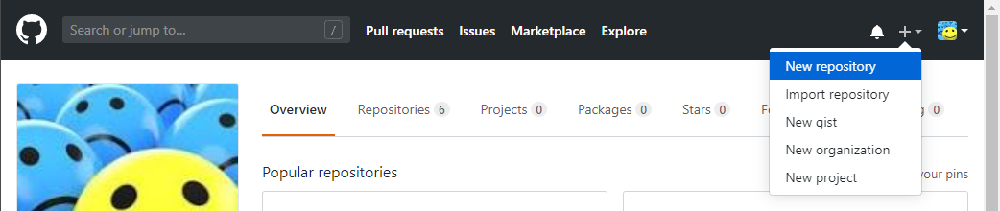
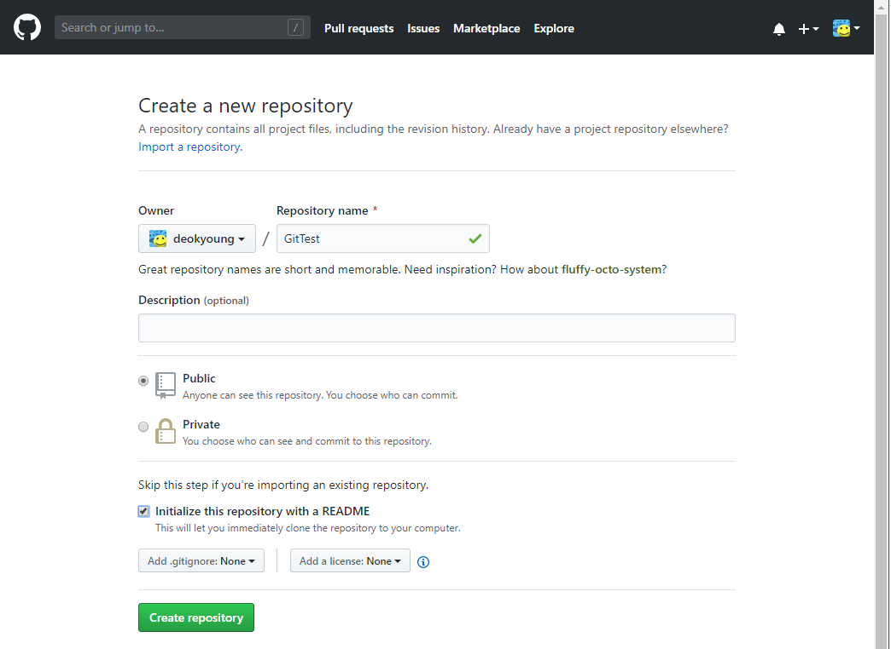
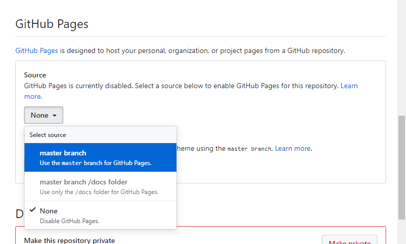
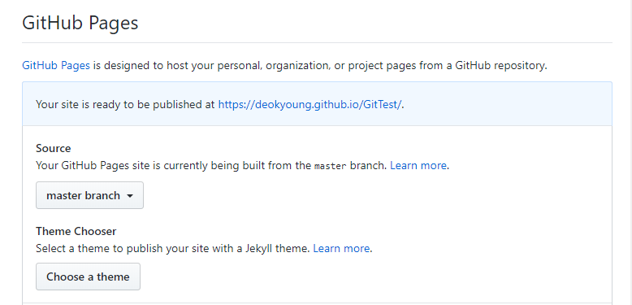
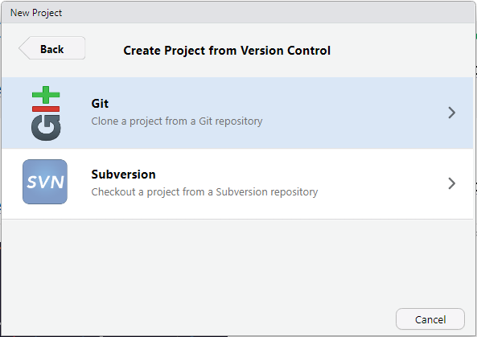
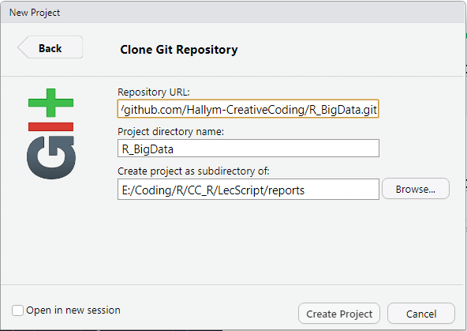
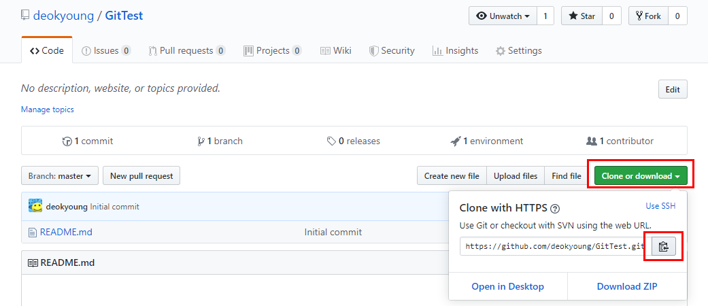
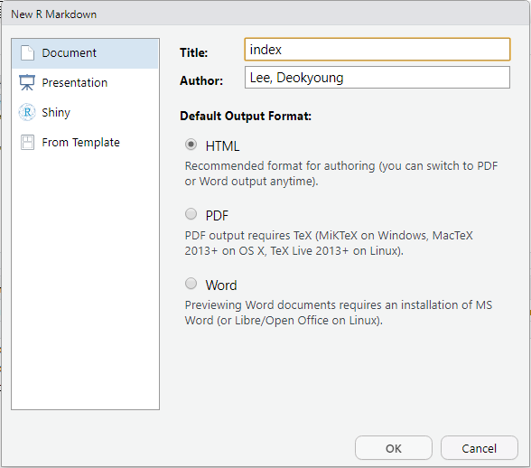

<style type="text/css">
body{ /* Normal  */
font-family: 함초롬돋움;
  font-size: 18px;
}
.table {
    width: 60%;
}
td {  /* Table  */
  font-size: 16px;
}
h1.title {
  font-family: 함초롬돋움;
  font-size: 48px;
  font-weight:bold;
  color: DarkRed;
}

h2 { /* Header 2 */
  font-weight:bold;
  color: DarkBlue;
}

h4 { /* Header 4 */
  font-family: 함초롬돋움;
  font-weight:bold;
}
h5 { /* 혼자서 해보기 */
  font-weight:bold;
  color: DarkRed;
}


</style>


```{r setup, include=FALSE}
knitr::opts_chunk$set(echo = TRUE)
```

##  1. R 마크다운
 데이터분석의 결과를 보고서 형식으로 작성하기 위한 저작도구로서 R코드와 마크다운을 하나의 파일에 결합한 것이다. 텍스트와 R 코드를 같이 놓고 작성할 수 있기 때문에 R 코드와 실행결과뿐 아니라 분석결과를 다른 사람과 쉽게 공유할 수 있고 HTML, PDF, MS워드 등의 다양한 형태의 문서를 만들 수 있다.
 
R마크다운 문서는 Rmd 파일에 저장되며 R코드와 마크다운을 YAML 헤더, 코드 청크, 마크다운으로 구성된다.   
작성한 Rmd 파일을 문서로 생성하기 위해서는 짜기(Knit)를 해야 한다. 짜기(Kint)를 통해 Viewer Pane에서 문서 생성 결과를 확인할 수 있다. 단축키(Ctrl + Shift + k)를 사용하면 빠르게 문서를 확인할 수 있다.

##### YAML 헤더      
  문서 처음에 ---와 --- 사이에 문서에 대한 사항으로 title, author, output 등의 필드와 값으로 구성된다. 

 
```{r eval=F, message=F}
---
title: "R 마크다운"
output: 
  html_document: 
---
```

##### 코드 청크    
  R마크다운 문서에서 R 코드를 실행하기 위해서는 아래와 같이  '''{r}과 ''' 사이에 코드를 입력해야 한다. 이 부분을 청크(chunk)라고 한다
 
  - 청크 삽입 : Ctrl + Alt + I
  - 청크 단위 실행 : Ctrl + Shift + Enter 
  - 한줄 실행: Ctrl + Enter
  

```{r eval=F, message=F} 

'''{r}

str(iris)

'''
```
  
##### 마크다운    
  텍스트를 HTML로 변환하는 도구로 웹저술을 돕는다. 
 
 

  

##  R 마크다운 문법
##### 제목 텍스트
제목을 단계적으로 나타내기 위해 # 기호를 사용한다.

```{r}

# 1단계 제목
## 2단계 제목
### 3단계 제목
#### 4단계 제목

```

># 1단계 제목
>## 2단계 제목
>### 3단계 제목
>#### 4단계 제목


##### 텍스트 입력
텍스틀 입력할 때 특정 텍스트를 강조하거나 링크를 삽입할 수 있다.     


```{r eval=F, message=F} 
# 기울임체 : 문자 앞뒤에 * 기호 삽입  =>  *창의코딩R* 
# 강조체 : 문자 앞뒤에 ** 기호 삽입  =>  **창의코딩R**  
# 취소선 : 문자 앞뒤에 ~~ 기호 삽입  =>  ~~창의코딩R~~ 
# 위 첨자 : 문자 앞뒤에 ^ 기호 삽입  =>  y=ax^2^ 
# 하이퍼링크 : 문자 앞위에 [ 기호삽입한 후 소괄호 안에 링크 입력 
#          =>   [창의코딩R 링크](https://hallym-creativecoding.github.io/R_BigData) 

```
   
> *창의코딩R*     
> **창의코딩R**      
> ~~창의코딩R~~       
> y=ax^2^         
> [창의코딩R 링크](https://hallym-creativecoding.github.io/R_BigData)   


텍스트 입력하다가 문단을 바꾸려면 **해당 줄의 끝에 스페이스를 두세 번 넣고 엔터**를 쳐 줄을 바꿔야 한다. 

##### 목록 만들기

순서없는 목록이나 순서있는 목록 만들기를 할 수 있다. 순서없는 목록은 새로운 문단에서 처음을 *이나 -로 시작하고, 순서있는 목록은 새로운 문단에서 숫자나 문자로 시작한다.


```{r eval=F, message=F} 
 - 순서없는 목록  
   * 한식 
     + 탕요리 
     + 면요리 
     + 기타 
   * 중식 
     + 기타

 - 순서있는 목록  
   1. 한식  
      a.탕   
      b.면   
      c.기타 
   2. 중식 
   3. 양식

```

 - 순서없는 목록  
   * 한식 
     + 탕요리 
     + 면요리 
     + 기타 
   * 중식 
     + 기타   
       
 - 순서있는 목록  
   1. 한식  
      a.탕   
      b.면   
      c.기타 
   2. 중식 
   3. 양식

##### 그림 삽입

R 코드의 그래프나 외부 그림을 삽입할 수 있다.    

- 청크와 R패키지의 그래프 함수를 이용하여 그림 삽입

```{r echo=F, warning= FALSE}
library(ggplot2)

```


```{r}
ggplot(data = mpg, aes(x = displ, y = hwy)) + geom_point(aes(color=drv, size=displ)) 

```

- 외부 그림 삽입

내 작업디렉토리 뿐 아니라 링크로 그림을 넣을 수도 있다.

```{r eval=F, message=F}

 

```

{ width=30% }

```{r eval=F, message=F}

{ width=50% }
```


{ width=50% }


##  2. Git에 올리기 

#####  Git 계정 설정

Git에 작성한 R마크다운 문서를 업로드하려면 Git에 계정이 있어야 한다. Git 계정이 없다면 먼저, 계정을 만든다.       
계정을 만든 후 다음 그림에서 보이는 곳을 눌러 새로운 레포지토리를 생성한다. 


{ width=75% }

아래 그림과 같이 **Public**을 선택하고 README 파일이 자동으로 만들어지도록 *항목을 체크*하고 [Create repository] 버튼을 누른다.


{ width=60% }

Repositoryr가 만들어지면 화면 상단 오른쪽 끝에 있는 Setting 탭을 클릭하여 GitHub Pages 항목을 그림과 같이 **master branch**로 설정하면 해당 위치에 홈페이지 주소창이 생성된다.  


{ width=70% }


{ width=70% }


##### R Studion 설정

**Version Control**로 새로운 프로젝트를 선택한 후 **Git**을 선택한다.


{ width=55% }

다음과 같은 화면이 나타난다. 세번째 항목에 Rmd 파일이 저장할 작업디렉토리를 선택하고, 첫번째 항목인 Repository URL에는 Git의 Repository URL을 복사하여 붙여넣어야 Git과 PC의 작업디렉토리가 연결된다.  


{ width=55% }


Git 화면에서 [Clone or download] 초록색 버튼을 누르면 URL 주소가 나타난다. 오른쪽 [복사] 버튼을 눌러 URL을 복사하여 R Studio의 Repository URL에 붙어넣는다.


{ width=70% }


R마크다운 문서를 만들기 위해 File 메뉴에서 [New File]-[R Markdown]을 선택한 후, Document 탭에서 HTML선택하고 Title에 문서이름을 입력한다. 


{ width=60% }

